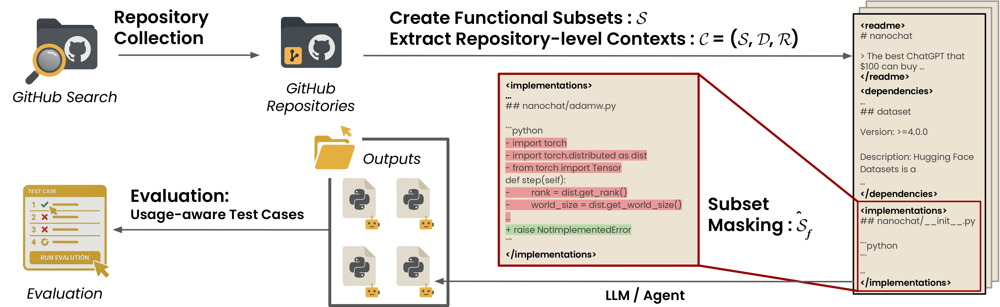

<p align="center">
  
</p>

<h1 align="center">ReCUBE: Repository-Level Code Reconstruction Benchmark</h1>

<p align="center">
  <a href="#">
    
  </a>
  <a href="https://huggingface.co/datasets/wlqmfl1999/recube-data">
    
  </a>
  <a href="https://hub.docker.com/repository/docker/wlqmfl0990/recube">
    
  </a>
</p>

A benchmark for evaluating LLMs on repository-level context utilization.

## Introduction

ReCUBE evaluates LLMs' ability to reconstruct complete, functional code files within real-world repositories:

- **Repository-level understanding:** Full codebase context with multiple files and dependencies
- **40 functional subsets** spanning AI agents, ML training, RAG systems, OCR, TTS, and more
- **366 target files** with comprehensive test suites (10,785 tests)
- **Docker-based evaluation** with reproducible, isolated test execution
- **External/internal test classification** for detailed capability analysis

## Quick Start

### Prerequisites

- Python 3.9+
- Docker (running)
- OpenAI API key (for API-based models) or vLLM (for open-source models)

### Installation

```bash
git clone https://github.com/JiseungHong/ReCUBE.git
cd ReCUBE
python3 -m venv venv && source venv/bin/activate
pip install -r requirements.txt

# Download benchmark data
pip install huggingface_hub
huggingface-cli download wlqmfl1999/recube-data --repo-type=dataset --local-dir data/

# Set API key (for API-based models)
export OPENAI_API_KEY="your-api-key-here"
```

### Generate & Evaluate

```bash
# 1. Generate outputs (choose one approach)
./scripts/run_api_key.sh agent_cce gpt-5              # Graph-guided agent
./scripts/run_api_key.sh agent_min_swe gpt-5          # Basic agent
./scripts/run_api_key.sh full-context_basic gpt-5     # Prompt-based

# 2. Run evaluation
./scripts/evaluate.sh agent_cce gpt-5

# 3. View results
cat results/agent_cce/gpt-5/overall_statistics.json
```

## Experimental Settings

| Setting | Description | Script |
|---------|-------------|--------|
| **agent_cce** | Graph-guided agent with dependency navigation | `utils/agent/cce/generate_output.py` |
| **agent_min_swe** | Agent with bash tools only | `utils/agent/min_swe/generate_output.py` |
| **full-context_basic** | Basic prompt with full repository context | `utils/full-context/basic/generate_output.py` |
| **full-context_cot** | Chain-of-Thought prompting | `utils/full-context/cot/generate_output.py` |

**For open-source models (vLLM):**
- Use `run_vllm.sh` with settings: `agent_cce_open_models`, `agent_min_swe_open_models`

## File Structure

```
ReCUBE/
├── config/                    # Agent configuration files
├── data/                      # Benchmark data (download from HuggingFace)
│   ├── graphs/               # Dependency graphs for CCE agent
│   ├── prompts/              # Repository context files
│   ├── tests/                # Test suites and metadata
│   ├── test_classifications/ # External/internal test labels
│   └── target.json           # 366 target files (40 repos)
├── outputs/                   # Generated code outputs
│   └── {setting}/{model}/{repo_id}/
├── results/                   # Evaluation results
│   └── {setting}/{model}/
├── scripts/                   # Execution scripts
│   ├── run_api_key.sh        # Run with API-based models
│   ├── run_vllm.sh           # Run with vLLM (open-source models)
│   └── evaluate.sh           # Run evaluation
└── utils/                     # Implementation
    ├── evaluate.py           # Evaluation script
    ├── agent/                # Agent implementations
    │   ├── cce/             # CCE agent (graph-guided)
    │   └── min_swe/         # Min-SWE agent (basic)
    └── full-context/         # Prompt-based approaches
```

## Evaluation Metrics

Results are saved to `results/{setting}/{model}/overall_statistics.json`:

- **Average Pass Rate (APR):** Average pass rate across all instances
- **Strict Pass Rate (SPR):** Percentage of fully resolved instances (100% tests passed)
- **External/internal breakdown:** Tests classified by usage patterns (API contract vs implementation)

## Citation

```bibtex
TBD
```
